# Memonto

Memoto is a social media platform that allows users to share posts and engage in real-time chatting. Built with a focus on simplicity and performance, it delivers a seamless user experience for staying connected with friends and communities.

## Features

- Share posts with your network
- Real-time chat functionality for instant communication
- Clean and intuitive user interface

## Technologies Used

- **Backend**: Node.js (Express.js)
- **Frontend**: React, Tailwind CSS, Redux
- **Database**: MongoDB
- **Real-time Functionality**: Socket.io
- **Authentication**: JSON Web Tokens (JWT)

## Installation

### Backend

1. Update all configuration files inside the `backend/config` directory with the appropriate settings.
2. To enable JWT authentication, you must set an environment variable as follows:

   **Windows**

   ```shell
   setx MEMONTO_JWT_PRIVATE_KEY "your-private-key"
   ```

   **Linux**

   ```shell
   echo 'export MEMONTO_JWT_PRIVATE_KEY=your-private-key' >> ~/.bashrc
   source ~/.bashrc
   ```

3. Start the backend server:
   ```shell
   npm start
   ```

### Frontend

1. Navigate to the `frontend` directory:

   ```shell
   cd frontend
   ```

2. Set up the `.env` file:

   ```shell
   cp .env.example .env
   ```

   Open the `.env` file and configure the following variables:

   ```plaintext
   VITE_API_BASE_URL=http://127.0.0.1:5000
   VITE_SOCKET_URL=http://127.0.0.1:8800
   ```

   - `VITE_API_BASE_URL`: The URL of your backend server.
   - `VITE_SOCKET_URL`: The URL of your Socket.io server.

3. Start the development server:
   ```shell
   npm run dev
   ```

## Screenshots

<p align="center">
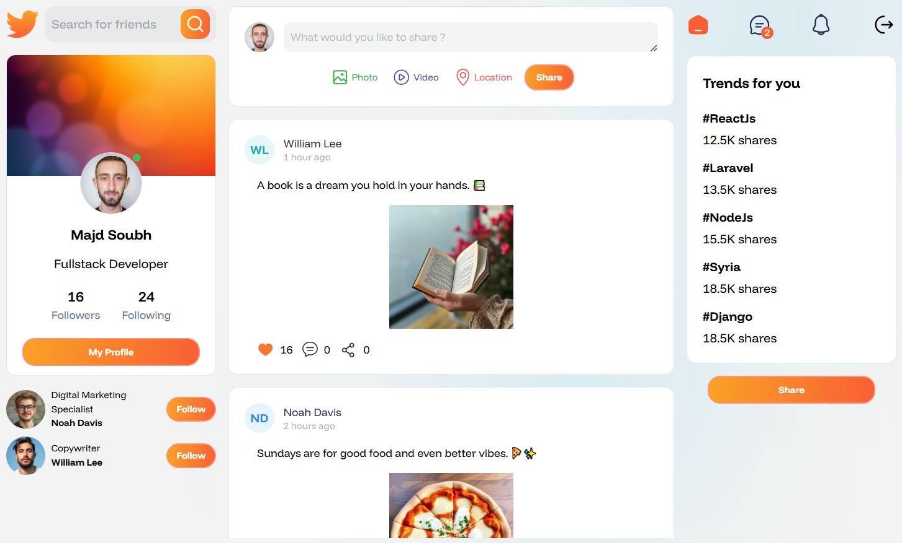
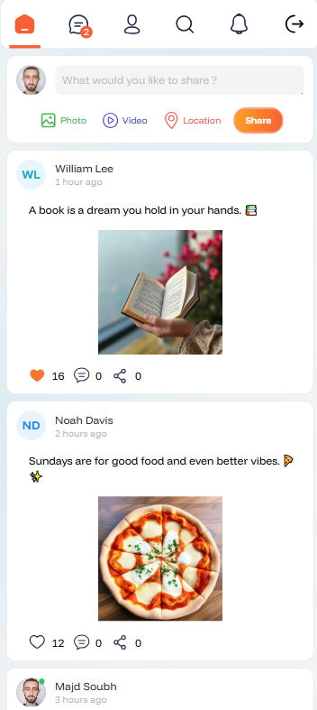
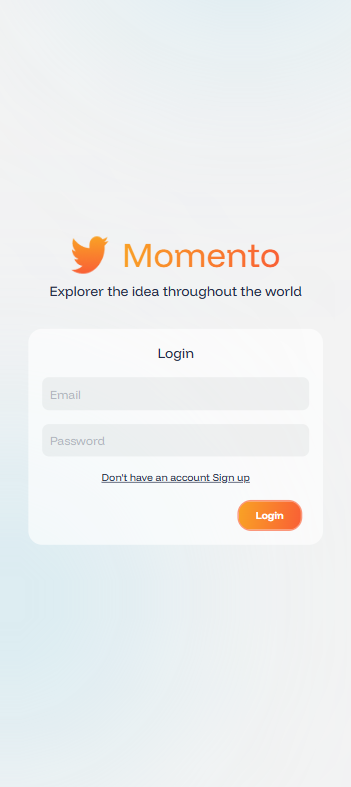
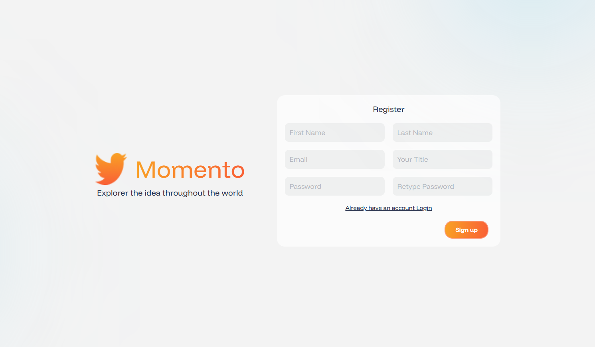
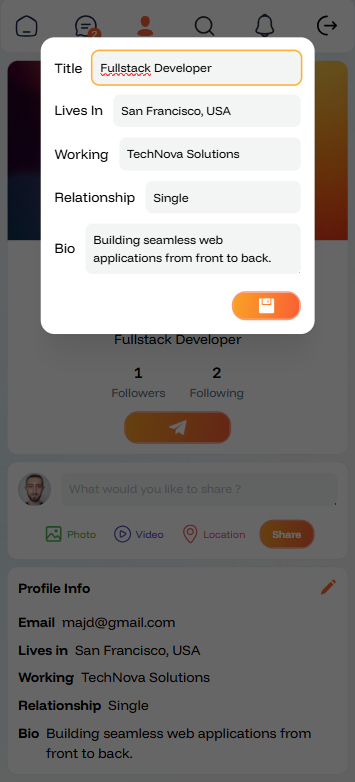
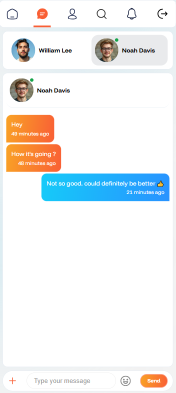
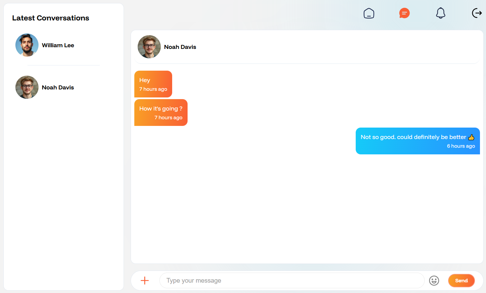
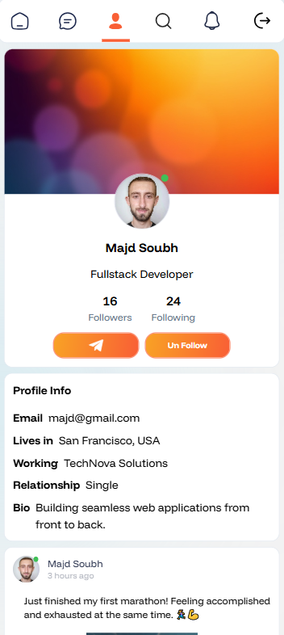
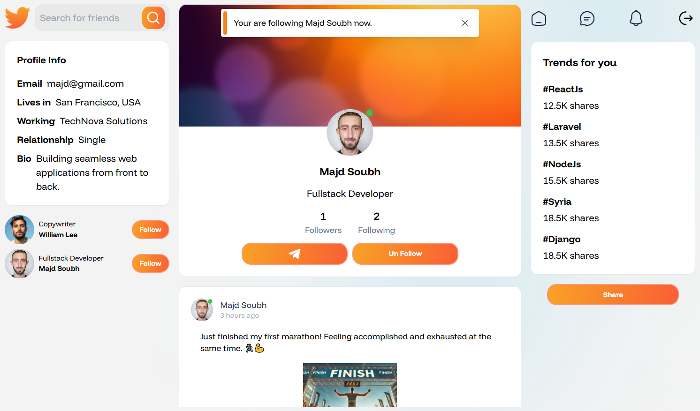
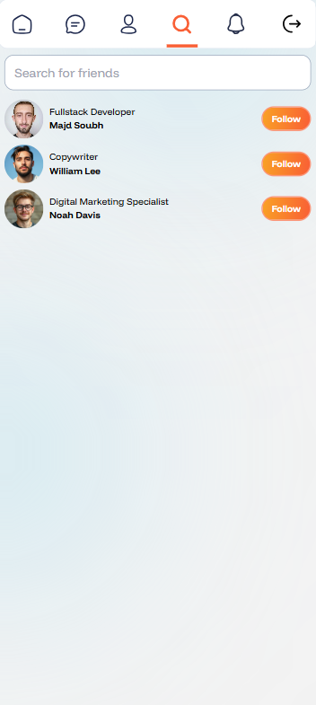
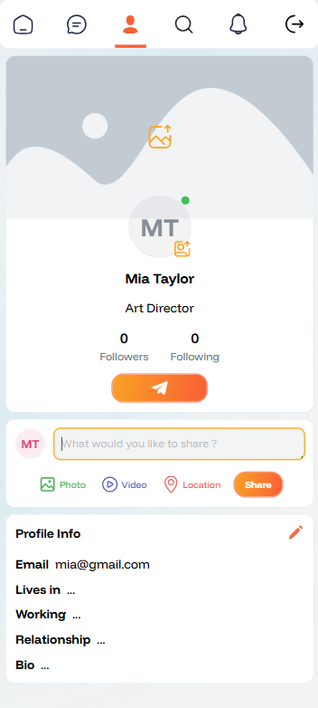
</p>
